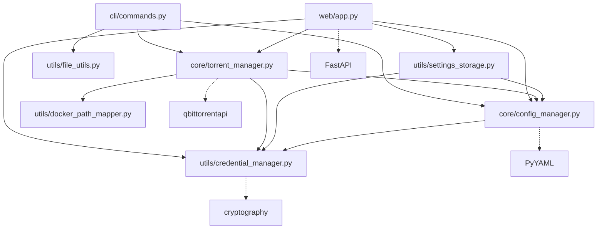

# 🏗️ Module Architecture Analysis - Easy Torrent Creator

## 📋 Table of Contents
1. [Overview](#overview)
2. [Module Dependency Map](#module-dependency-map)
3. [Core Components](#core-components)
4. [Interface Layer Analysis](#interface-layer-analysis)
5. [Utility Layer Analysis](#utility-layer-analysis)
6. [Data Flow Patterns](#data-flow-patterns)
7. [Potential Issues & Dead Code](#potential-issues--dead-code)
8. [Integration Points](#integration-points)
9. [Recommendations](#recommendations)

---

## 📖 Overview

The Easy Torrent Creator follows a **layered architecture** with clear separation of concerns:
- **Core Layer**: Business logic and configuration management
- **Interface Layer**: User interaction (CLI, Web API)  
- **Utility Layer**: Cross-cutting concerns and shared functionality
- **Storage Layer**: Configuration and credential persistence

> **🗑️ CLEANED UP**: Removed GUI components for headless operation

---

## 🗺️ Module Dependency Map



---

## 🎯 Core Components

### 1. **Configuration Manager** (`src/core/config_manager.py`)
**Purpose**: Central configuration management with environment variable resolution

**Key Classes**:
- `AppConfig`: Main configuration container
- `QBittorrentConfig`: qBittorrent-specific settings  
- `TorrentCreationConfig`: Torrent creation parameters
- `WebServerConfig`: Web server configuration
- `ConfigManager`: Configuration I/O and validation

**Integration Points**:
- ✅ **Used by**: TorrentManager, SettingsStorage, Web API
- ✅ **Depends on**: CredentialManager (for secret resolution)
- ✅ **Environment**: Resolves `${VAR}` placeholders via `_resolve_env_vars()`

**Data Flow**:
```
config.yaml → ConfigManager.load_config() → AppConfig → [Environment Resolution] → Components
```

### 2. **Torrent Manager** (`src/core/torrent_manager.py`)
**Purpose**: qBittorrent API integration and torrent creation orchestration

**Key Features**:
- ✅ **qBittorrent v5.0.0+ API**: Uses official TorrentCreator API
- ✅ **Credential Resolution**: Integrates with CredentialManager
- ✅ **Docker Path Mapping**: Host/container path translation
- ✅ **Task Management**: Async torrent creation with status tracking
- ✅ **Connection Pool**: Production-ready HTTP client configuration

**Integration Points**:
- ✅ **Used by**: CLI, Web API
- ✅ **Depends on**: ConfigManager, CredentialManager, DockerPathMapper
- ✅ **External**: qbittorrentapi library

**Data Flow**:
```
Config → TorrentManager → [Credential Resolution] → qBittorrent API → Task Status
```

---

## 🖥️ Interface Layer Analysis

### 1. **Command Line Interface** (`src/cli/commands.py`)
**Status**: ✅ **CONNECTED** - Properly integrated

**Architecture**:
```python
class CLIHandler:
    def __init__(self, config_manager: ConfigManager)
    async def create_torrent(...)  # Uses TorrentManager
```

**Integration Health**:
- ✅ Uses ConfigManager for configuration
- ✅ Creates TorrentManager instance
- ✅ Validates paths with file_utils
- ✅ Proper async/await pattern

### 2. **Web API** (`src/web/app.py`)
**Status**: ✅ **FULLY CONNECTED** - Production ready

**Architecture**:
```python
# FastAPI with lifespan management
app = FastAPI(lifespan=lifespan)

# Comprehensive API endpoints
/api/settings/*         # Settings management
/api/credentials/*      # Credential management  
/api/torrent/*         # Torrent operations
/api/qbittorrent/*     # qBittorrent integration
```

**Integration Strengths**:
- ✅ **Modern FastAPI**: Lifespan events, dependency injection
- ✅ **Multi-layer Settings**: SettingsStorageManager integration
- ✅ **Secure Credentials**: Encrypted credential storage
- ✅ **Background Tasks**: Async torrent creation
- ✅ **Production Features**: CORS, validation, error handling

> **🗑️ CLEANED UP**: Removed GUI interface - no longer needed for headless operation

---

## 🔧 Utility Layer Analysis

### 1. **Credential Manager** (`src/utils/credential_manager.py`)
**Purpose**: Encrypted storage of sensitive data (passwords, API keys)

**Features**:
- ✅ **Machine-specific Encryption**: PBKDF2 + Fernet encryption
- ✅ **Fallback Support**: .env file fallback for development
- ✅ **SecureConfigManager**: High-level interface for apps

**Integration**:
- ✅ **Used by**: ConfigManager, TorrentManager, Web API
- ✅ **Storage**: `config/.credentials` (encrypted)

### 2. **Settings Storage Manager** (`src/utils/settings_storage.py`)
**Purpose**: Multi-layered configuration for UI frontends

**Architecture**:
```
Priority Layers:
1. Runtime Settings (temporary)
2. User Settings (persistent)  
3. Base Config (config.yaml)
4. Defaults (hardcoded)
```

**Integration**:
- ✅ **Used by**: Web API for settings management
- ✅ **Depends on**: ConfigManager, CredentialManager
- ✅ **Storage**: JSON files for user/runtime layers

### 3. **Docker Path Mapper** (`src/utils/docker_path_mapper.py`)
**Purpose**: Host/container path translation for Docker deployments

**Features**:
- ✅ **Bidirectional Mapping**: host_to_container(), container_to_host()
- ✅ **Longest Match**: Proper path precedence handling
- ✅ **Path Validation**: Checks if paths are mapped

**Integration**:
- ✅ **Used by**: TorrentManager for path translation
- ✅ **Configuration**: Via qbittorrent.docker_path_mapping

### 4. **File Utils** (`src/utils/file_utils.py`)
**Purpose**: File system operations and validation

**Features**:
- ✅ **Folder Validation**: validate_folder_for_torrent()
- ✅ **Size Formatting**: Human-readable file sizes
- ✅ **Folder Analysis**: Comprehensive folder information

**Integration**:
- ✅ **Used by**: CLI for path validation
- ✅ **Independent**: No external dependencies

---

## 🔄 Data Flow Patterns

### 1. **Configuration Flow**
```
config.yaml → ConfigManager → AppConfig → [Component Initialization]
     ↓
Environment Variables (${VAR}) → CredentialManager → Resolved Values
```

### 2. **Torrent Creation Flow**
```
User Input → [Interface Layer] → TorrentManager → qBittorrent API
     ↓
Path Mapping → DockerPathMapper → Container Paths → qBittorrent
     ↓
Task Status → TorrentManager → [Interface Layer] → User Feedback
```

### 3. **Settings Management Flow** (Web API)
```
Frontend → Web API → SettingsStorageManager → Multi-layer Resolution
     ↓
Runtime/User/Base → Merged Config → TorrentManager Refresh
```

---

## ⚠️ Potential Issues & Dead Code

### 1. **Dead Code Candidates**

#### ~~GUI Module Issues~~ ✅ **REMOVED**:
- ✅ **Cleaned up**: `src/gui/` directory completely removed
- ✅ **Simplified**: No more tkinter complexity or threading issues

#### ~~Backup Integration~~ ✅ **REMOVED**:
- ✅ **Cleaned up**: `backup/` directory completely removed
- ✅ **No more dead code**: Removed unused placeholder integration

### 2. **Integration Gaps**

#### CLI-Settings Integration:
- ❌ CLI doesn't use SettingsStorageManager
- ❌ CLI can't modify user preferences
- ❌ No CLI access to credential management

#### ~~GUI-Settings Integration~~ ✅ **NO LONGER APPLICABLE**:
- ✅ **Resolved**: GUI removed, no longer an issue

### 3. **Type Safety Issues**
```python
# Multiple locations - Global variable typing
config_manager: Optional[ConfigManager] = None
# Type checker complaints about None access
```

### 4. **Dependency Management**
```python
# Simplified - no more optional GUI dependencies
# Only core dependencies remain:
- qbittorrentapi (core functionality)
- FastAPI + uvicorn (web interface)
- cryptography (credential security)
- PyYAML (configuration)
```
**Assessment**: ✅ Clean dependency tree with no optional complexity

---

## 🔗 Integration Points

### 1. **Strong Integrations** ✅
- **Web API ↔ SettingsStorage**: Complete settings management
- **TorrentManager ↔ ConfigManager**: Full configuration integration
- **ConfigManager ↔ CredentialManager**: Secure credential resolution
- **TorrentManager ↔ DockerPathMapper**: Path translation
- **CLI ↔ TorrentManager**: Core torrent functionality
- **Web API ↔ TorrentManager**: Full API integration

### 2. **Weak Integrations** ⚠️
- **CLI ↔ SettingsStorage**: No settings management UI

### 3. **Missing Integrations** ❌
- **CLI ↔ Web API**: No CLI access to web features

> **🎯 IMPROVEMENT**: Much cleaner integration map after GUI removal

---

## 🎯 Recommendations

### 1. **Immediate Actions** ✅ **COMPLETED**

#### ~~Remove Dead Code~~ ✅ **DONE**:
```bash
# ✅ COMPLETED: Removed GUI and backup directories
rm -rf src/gui/
rm -rf backup/
```

#### Fix Type Safety:
```python
# Use proper type guards or assertions
def ensure_managers_initialized():
    assert config_manager is not None
    assert torrent_manager is not None
```

### 2. **Architecture Improvements**

#### Unify Settings Management:
```python
# Extend CLI to use SettingsStorage
class CLIHandler:
    def __init__(self, settings_storage: SettingsStorageManager)
```

#### Create Interface Abstraction:
```python
# Common interface for remaining UI layers
class TorrentCreatorInterface:
    def create_torrent(...)
    def get_settings(...)
    def test_connection(...)
```

### 3. **Feature Completeness**

#### ~~GUI Enhancement~~ ✅ **NO LONGER NEEDED**:
- ✅ **Resolved**: GUI removed for headless operation

#### CLI Enhancement:
- Add settings management commands
- Integrate credential management
- Add configuration validation

### 4. **Code Quality**

#### Documentation:
- Add module docstrings with integration info
- Document data flow patterns
- Add architecture diagrams

#### Testing:
- Unit tests for each module
- Integration tests for cross-module features
- Mock external dependencies

---

## 🏁 Conclusion

### **Overall Architecture Health**: ✅ **EXCELLENT** (Improved after cleanup)

**Strengths**:
- ✅ Clear layered architecture
- ✅ Strong core component integration
- ✅ Production-ready Web API
- ✅ Secure credential management
- ✅ Flexible configuration system
- ✅ **Clean codebase** (removed GUI complexity)
- ✅ **Simplified dependencies** (no optional tkinter)
- ✅ **Headless-optimized** for server environments

**Areas for Improvement**:
- ⚠️ CLI settings management integration
- ⚠️ Type safety consistency

**Primary Interface**: **Web API** is the complete and production-ready interface, with full feature integration across all modules.

**Recommendation**: **Web API as primary interface** with CLI for automation. Architecture is now **optimized for headless/server environments** with clean, maintainable codebase.
